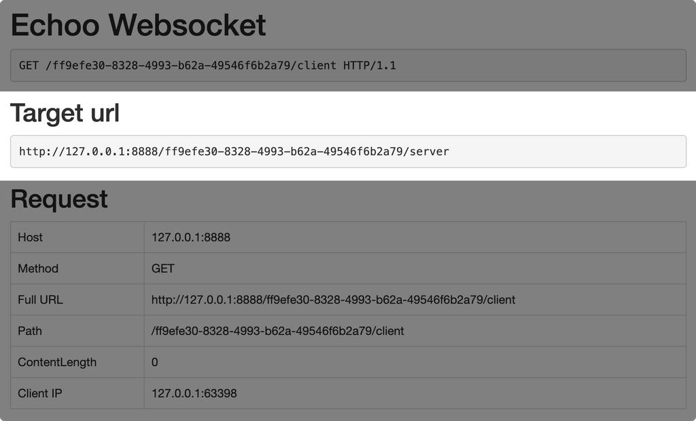

# Echoo

一个用 Go 语言编写的 echo 服务器

[下载地址](https://github.com/AielloChan/echoo/tree/master/dist)

## 四大模式

[echo 模式](#echo) [terminal 模式](#terminal) [file 模式](#file) [websocket 模式](#websocket)

### echo

```bash
> echoo -m echo
INFO[0000] Echoo serving at http://0.0.0.0:8888

```

此模式也是程序默认运行模式。此模式开启后，会输出一个 url（如上图中的 `http://0.0.0.0:8888`）。
在浏览器中打开这个地址，便能够看到，你当次请求页面的相关信息，包括 url 参数、header 等等。

试试改变 url 参数，并再次访问，它会将你每次的请求信息都以 html 形式返回到浏览器上。

### terminal

```bash
> echoo -m terminal
INFO[0000] Echoo serving at http://0.0.0.0:8888

```

该模式会不是像 **echo** 模式那样输出在浏览器中，而是直接在命令行中输出访问 url 时的请求信息。

### file

```bash
> echoo -m file
INFO[0000] Echoo serving at http://0.0.0.0:8888

```

其实这个模式就是将上面 terminal 中输出的内容保存在文件里（以后会将此模式直接迁移为 log，
从而在所有模式中使用此功能）。它默认将日志存放在 **logs/log.txt** 文件中，你也可以在后面
以 `-f 自定义日志文件地址` 来自定义地址。

### websocket

通过 websocket 技术，你可以将指定链接被访问时使用的请求信息，直接显示在另一个页面中，且是实时更新的

```bash
> echoo -m ws
INFO[0000] Echoo serving at http://0.0.0.0:8888

```

这个是最有意思，也是覆盖场景最多的模式。

当启动这个模式后，你需要做以下几步操作：

1. 先在浏览器中访问上面输出的地址，如（http://0.0.0.0:8888）
2. 服务器会自动给你分配一个测试地址，并且将你刚才访问的页面重定向到分配给你的测试页面，如（http://0.0.0.0:8888/4bf26e4f-7324-4942-a21c-706575cdb34d/client）
3. 在当前的浏览器页面上，你能看到你刚才请求这个页面的相关信息，同时，你能发现，页面上多了一个名为 **Target** 的板块，如下图：
  
4. 试着将该 url 设置为你服务器访问的目标地址（如 nginx 中的 proxy_pass 目标地址等，或者可以直接在另一个浏览器中访问该 **Target url**）
5. 大功告成，每次访问 **Target url** 的请求信息，都会在第 2 步中打开的那个页面中显示，并且是**实时更新**

有了这个功能，我们调试服务器又简单了不少😼

**`./echoo -v` 或者 `./echoo -h` 获得详细信息**

## 源码构建

*所有构建成功的可执行程序都存放在 **dist** 目录下*

```bash
git clone https://github.com/AielloChan/echoo.git
cd echoo
# 下面这条命令是将静态资源打包
./package.sh
./build.sh
./echoo
```

（Windows 运行后会有一些奇怪的字符显示，这是因为颜色字符在非 TTY 终端下输出错误的问题，如果你有好的解决方案，请不惜赐教）

Have Fun!
